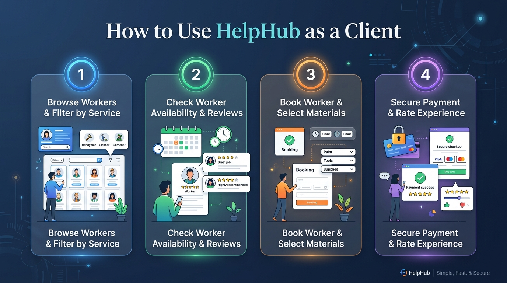
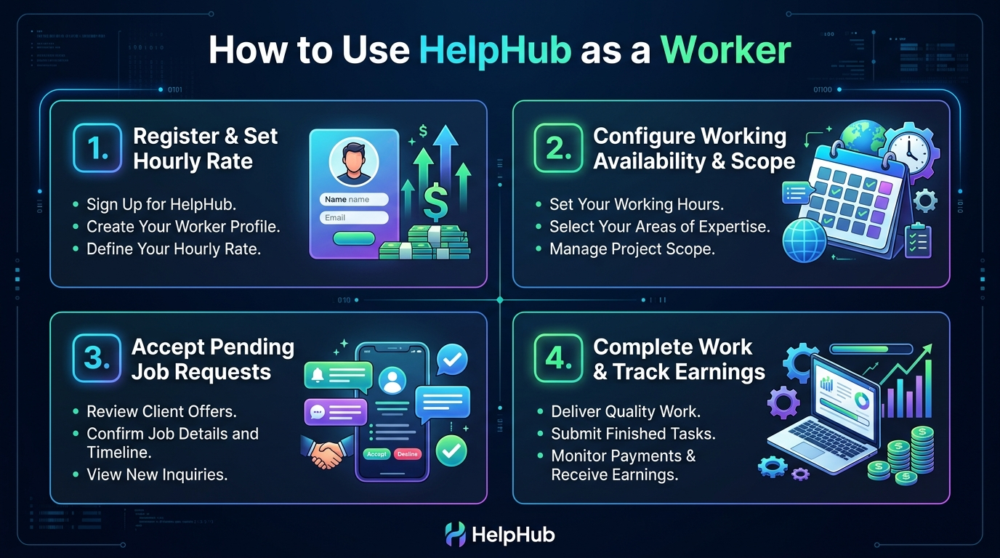

<div align="center">

# 🛠️ HelpHub
### *On-Demand Local Services Marketplace & Professional Worker Portal*


---

**HelpHub** is a next-generation full-stack service marketplace connecting clients with verified local service professionals (*electricians, plumbers, painters, cleaners, carpenters, AC repair technicians, appliance experts, and general labour*).

</div>

---

## 🌟 Key Features at a Glance

| Feature | Description |
| :--- | :--- |
| 🌐 **Tri-Lingual Support** | Seamless real-time switching between **English**, **తెలుగు (Telugu)**, and **हिंदी (Hindi)** across the entire application. |
| 🔄 **Dual-Role Accounts** | Operate under the same email as both **Client** and **Worker** without losing any profile data or booking history. |
| 🖼️ **Profile Photo Uploads** | Personalize your profile with custom photo uploads (file selection or web URL) with live image previews. |
| 🗓️ **Flexible Schedule Scopes** | Set working availability by **Recurring Weekly**, **Specific Month Only**, or **Custom Date Ranges**. |
| 🛡️ **Email Verification** | Secure authentication workflow via mandatory email verification links for both clients and workers. |
| 📊 **Transparent Pricing & Reviews** | Detailed cost breakdowns (*Labour + Materials + Travel*) and dual-dimension ratings (*Overall + Behaviour*). |

---

## 🌐 Multi-Language Support

HelpHub features a built-in internationalization context allowing instant language switching without page reloads:

```
┌─────────────────────────────────────────────────────────────┐
│ 🌐 Language Selector                                        │
├────────────────────────────────┬────────────────────────────┤
│ 🇬🇧 English (Default)           │ Primary English UI          │
│ 🇮🇳 తెలుగు (Telugu)             │ Full Telugu translation    │
│ 🇮🇳 हिंदी (Hindi)               │ Full Hindi translation     │
└────────────────────────────────┴────────────────────────────┘
```

> [!NOTE]
> Language preferences are automatically saved and restored across sessions.

---

## 🔄 Dual-Role Account & Role Switcher

HelpHub eliminates the friction of managing separate accounts by supporting **Dual-Role Sessions** under a single email address.

> [!IMPORTANT]
> **Zero Data Erasure**: Switching between Client and Worker portals preserves 100% of your Client bookings, address records, Worker profile details, hourly rates, and working schedules in the database.

- **Active Session Prompt**: When visiting `/login` while logged in, HelpHub presents an interactive modal asking to **Continue to Current Portal**, **Switch to Other Portal**, or **Logout**.
- **One-Click Header Switch**: Switch between **Client Portal** and **Worker Portal** anytime via header action bar buttons (`Switch to Worker Portal` / `Switch to Client Portal`).

---

## 📖 How to Use HelpHub

### 👤 1. Client Guide: Finding & Booking Service Workers



#### Step-by-Step Client Workflow:

1. **Account Registration & Verification**
   - Click **Register** → Select **Client Account**.
   - Provide your details and click **Verify Email** from the confirmation email link.
2. **Search & Filter Workers**
   - Navigate to **Browse Workers**.
   - Select a service category (*Electrician, Plumber, Painter, AC Repair, Cleaning, etc.*).
   - Enter your city/location to locate nearby professionals.
3. **Inspect Worker Profile & Availability**
   - Click **View Details** on any worker card to view ratings, past reviews, experience, and hourly rates.
   - Inspect their **Working Availability** schedule duration scope (*Recurring Weekly*, *Month Only*, or *Custom Dates*).
4. **Book & Customize Order**
   - Click **Book Worker**.
   - Select appointment date/time, number of workers required, material provision preference (*Provided by Client* vs *Provided by Worker*), and job description.
5. **Payment & Review**
   - Review transparent cost breakdown (*Labour + Materials + Travel Fee*).
   - Complete job & rate the worker with overall stars, review comments, and **Behaviour Rating**.

---

### 👷 2. Worker Guide: Offering Services & Managing Schedules



#### Step-by-Step Worker Workflow:

1. **Register & Create Professional Profile**
   - Register as a **Worker Account** and verify your email.
   - Upload your **Profile Picture Avatar** via `Edit Profile`.
2. **Set Specialization & Rates**
   - Select primary and secondary service skills in **Specialization**.
   - Set your hourly service rate (**₹/hr**).
3. **Configure Schedule & Duration Scope**
   - Go to **My Availability**.
   - Choose your duration mode:
     - 🔁 **Permanent (Every Week)**: Indefinite weekly schedule.
     - 🗓️ **Specific Month Only**: Valid strictly for a selected month (e.g., *September 2026*).
     - 📅 **Custom Date Range**: Valid between selected start and end dates.
   - Toggle working days and specify start/end hours per day.
4. **Accept Bookings & Earn**
   - View pending job requests under **Worker Dashboard**.
   - Click **Accept** or **Reject**. Update job status to *In Progress* and *Completed* upon finishing work.

---

## 💻 Tech Stack Architecture

| Layer | Technology | Details |
| :--- | :--- | :--- |
| **Frontend** | React 18 (Vite) | SPA architecture, Vanilla CSS modules, Lucide Icons, Custom i18n Context |
| **Backend** | Node.js + Express | RESTful API controllers, JWT authentication middleware, NodeMailer |
| **Database** | PostgreSQL | Relational pool connection, normalized schemas with foreign keys |
| **Storage** | Base64 / Local URL | Optimized avatar photo storage and instant data preview |

---

## 🚀 Local Installation & Setup Guide

### 1. Prerequisites
- Node.js (v18+)
- PostgreSQL Database server

### 2. Database Setup
Create database `helphub_db` in PostgreSQL and run migration scripts.

### 3. Start Backend Server
```bash
cd server
npm install
npm run dev
```
*Backend server runs on `http://localhost:5000`*

### 4. Start Frontend Client
```bash
cd client
npm install
npm run dev
```
*Frontend app runs on `http://localhost:5173`*

---

<div align="center">
Made with ❤️ for HelpHub - Connecting Local Talent with Local Needs
</div>
# Helphub
